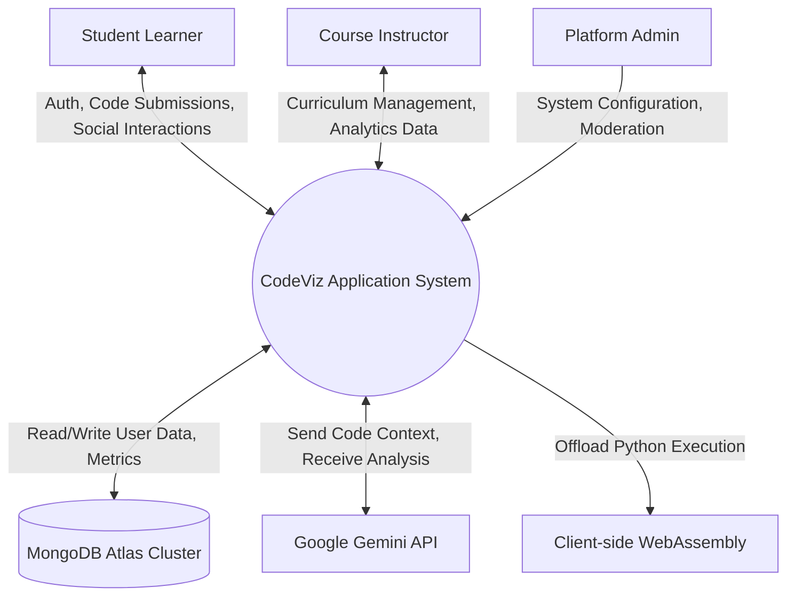
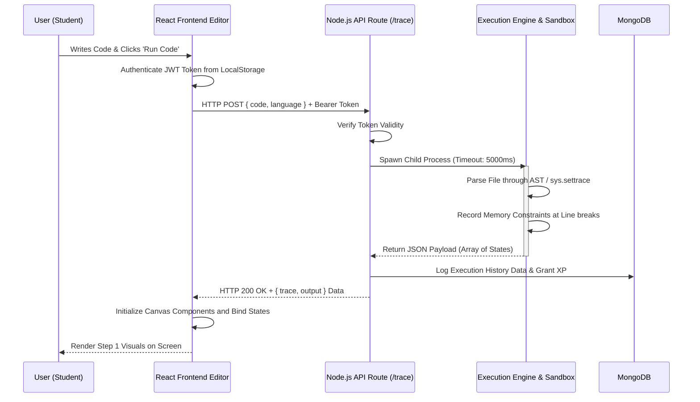
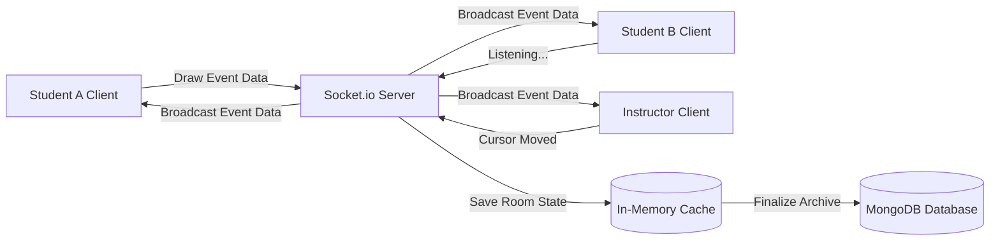
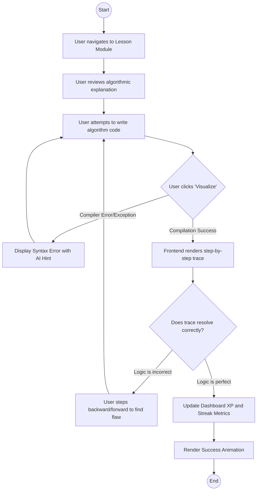

# PROJECT REPORT

**PROJECT TITLE:** CodeViz — Learn Data Structures and Algorithms Visually
**DOMAIN:** Educational Technology (EdTech) / Web Application Development
**TECHNOLOGY STACK:** MERN Stack (MongoDB, Express.js, React.js, Node.js), Pyodide, Framer Motion, Socket.io

---

## ABSTRACT

In the contemporary landscape of computer science education, one of the most significant cognitive barriers for students is the abstract nature of programming concepts, particularly Data Structures and Algorithms (DSA). Traditional learning environments rely heavily on static text, mathematical proofs, and abstract chalkboard representations, which often fail to convey the dynamic, state-changing nature of code during execution. This project, **CodeViz**, aims to bridge this pedagogical gap by providing a highly interactive, visual, and gamified web-based learning platform. 

CodeViz goes beyond the capabilities of standard code editors or static visualization websites by integrating a proprietary line-by-line execution tracing engine for Python and JavaScript. This engine parses user-submitted code in real-time, extracts memory states, call stacks, and variable mutations, and binds this data to a highly responsive graphical canvas. The platform encompasses a massive array of features including a "Practice Playground" for algorithm sandbox testing, an "AI Code Narrator" that utilizes advanced Large Language Models to explain line-by-line logic like a human tutor, competitive "Code Battles" for synchronous multiplayer algorithm racing, and "Campus Dashboards" designed for institutional use where instructors can monitor student progress vectors. 

The application is built using a robust MERN stack architecture, employing React.js and Framer Motion for a fluid, cyberpunk-themed "Neural Gateway" user interface, while Node.js and Express handle the backend execution sandboxing, real-time WebSocket communication, and RESTful API serving. A MongoDB database ensures persistent storage of user gamification metrics, XP, streaks, code snippets, and social interactions. Extensive usability testing and security validation protocols were strictly followed to ensure that the execution of arbitrary user code occurs within safely isolated bounds. Ultimately, CodeViz proves to be a comprehensive ecosystem that transforms the solitary, abstract process of learning DSA into a deeply engaging, visually intuitive, and socially collaborative experience.

---

## 1. INTRODUCTION

### Overview
The discipline of Computer Science relies fundamentally on the mastery of Data Structures and Algorithms. However, the dropout rates and frustration levels in introductory computing courses globally highlight a severe instructional flaw: the tools used to teach dynamic processes are overwhelmingly static. When a student executes a sorting algorithm, the compiler traditionally acts as a "black box," taking inputs and returning outputs, while the intermediate state variations—how the array shifts, how the pointers move—remain hidden from the learner's eyes. 

CodeViz was conceptualized to tear down this black box. By creating a transparent execution environment, CodeViz allows users to peer into the machine's memory layout as their code runs. The project is an enterprise-scale Educational Technology platform that fuses the capabilities of an Integrated Development Environment (IDE) with the visual feedback of an algorithmic simulator, wrapped within a highly engaging, gamified user interface. It is specifically designed to reduce cognitive load, accelerate comprehension, and foster continuous engagement through behavioral psychology elements such as streak tracking, experience points (XP), and peer motivation.

### 1.1 PROJECT DESCRIPTION
CodeViz is a full-stack web application dedicated to visualizing computer programming logic. It operates on a client-server architecture where the client is a rich web interface built with React.js, and the server is a Node.js/Express environment that securely manages user data and orchestrates code execution. The platform tackles learning from multiple angles: structured learning paths (Lessons), unstructured experimentation (Practice), collaborative problem-solving (Classrooms), and competitive programming (Code Battles).

The platform introduces innovations such as:
- **Real-Time Memory Tracing:** Parsing Python and Javascript abstract syntax trees (AST) to generate step-by-step memory snapshots.
- **AI-Driven Contextual Help & Forensics:** Integrating external AI APIs to provide "Explain Like I'm 5" (ELI5) functionality, semantic complexity analysis (Big-O notation detection), real-time audio narration of code execution, and an **AI Authorship Detective** capable of mathematically profiling if a student's submission was likely generated by another AI.
- **Institutional Integration:** Dedicated instructor dashboards capable of generating assignments, analyzing classroom performance curves, and administering live whiteboard sessions.

### Objectives
The primary objectives of the CodeViz project are to:
1. **Demystify Abstract Concepts:** Translate abstract programmatic changes (like linked list pointer manipulations or recursive tree traversals) into concrete, easily understandable visual animations.
2. **Promote Active Learning:** Move students away from passive video consumption by forcing them to write code, encounter errors, and visually debug their logic line by line.
3. **Enhance Engagement through Gamification:** Implement a reward psychology system using XP, badges, daily challenges, and leaderboards to dramatically increase user retention.
4. **Facilitate Social Learning:** Create collaborative spaces such as discussion forums, peer code reviews, and live multiplayer algorithmic battles.
5. **Empower Educators:** Provide instructors with granular analytics on student performance, allowing for data-driven teaching interventions.
6. **Ensure Secure Code Execution:** Implement robust backend sandboxing techniques to prevent malicious code from harming the server infrastructure.

### Scope
The scope of CodeViz covers three distinct user domains:
- **Learner Module:** Includes personal dashboards, structured roadmap lessons, free-form practice visualizers, AI tutors, daily challenges, code submission histories, and a public portfolio generator.
- **Instructor Module:** Features tools to create assignments, view student progress analytics, establish virtual classrooms with integrated whiteboards, and broadcast live code solutions.
- **System Administration:** Encompasses user management, content moderation for forums, system health monitoring, and gamification metric configuration.

The project does not currently encompass compilation for mobile-native environments (iOS/Android applications), focusing strictly on a responsive web-based delivery model to maximize cross-platform accessibility.

---

## 2. LITERATURE SURVEY

### 2.1 EXISTING AND PROPOSED SYSTEM

**Existing Systems:**
The educational software market has several prominent players, but they generally fall into two extremes, lacking a middle ground:
1. **Competitive Programming Platforms (e.g., LeetCode, HackerRank):** These are excellent for practicing and testing code against massive datasets. However, they operate purely as black boxes. When a student's code fails a test case, they are provided with only the input and the incorrect output, offering zero visual context on *where* the algorithmic logic derailed. They are inherently unfriendly to absolute beginners.
2. **Algorithmic Simulators (e.g., VisuAlgo, USFCA Visualizations):** These platforms provide beautiful, hand-crafted animations of standard algorithms. However, they do not execute user-written code. The user watches a static simulation of a predefined algorithm. If a student wants to see what happens when they tweak a variable, they cannot do so.
3. **Execution Tracers (e.g., Python Tutor):** Python Tutor steps through user-written code line by line. While highly effective educationally, its user interface is outdated, lacks modern gamification, has zero social or competitive elements, and struggles with large inputs or complex multi-file projects.

**Proposed System:**
CodeViz acts as the ultimate synthesis of the aforementioned platforms, proposing a system that merges arbitrary user code execution with high-fidelity visual animations, while surrounding the core mechanic with modern SaaS features.
The proposed system allows the user to type arbitrary Python or JavaScript code. The backend engine intercepts this code, injects proprietary tracing libraries or compiles it into an Abstract Syntax Tree (AST), executes it within a time-limited sandbox, and returns a JSON payload detailing the state of all variables and the call stack at every single line of execution. The frontend React application parses this JSON payload and renders state-of-the-art animations across a "Cyberpunk-themed" interface, utilizing Framer Motion physics. Furthermore, the proposed system introduces AI integration, automatically determining the Time and Space Complexity (Big-O) of the user's distinct implementation.

### 2.2 FEASIBILITY STUDY

A thorough feasibility study was conducted to determine the viability of CodeViz across three crucial dimensions:

**1. Technical Feasibility:**
The project was deemed technically feasible due to the maturity of the MERN stack. React.js expertly handles the complex, rapidly updating state required for a step-by-step visualizer. Node.js with `child_process` modules allows for the asynchronous execution of scripts. The primary technical hurdle—sandboxing arbitrary user code safely—was resolved using process timeouts, memory limitations, and the integration of client-side execution via `Pyodide` (WebAssembly Python) to offload execution risk from the server.

**2. Economic Feasibility:**
CodeViz is highly economically feasible. The open-source nature of the foundational technologies (MongoDB, Node.js, React) eliminates licensing costs. Hosting can be initiated on scalable cloud providers (AWS, Heroku, Vercel) with pay-as-you-go models, minimizing upfront capital expenditure. The potential for monetization exists through premium AI-narrator features or institutional licensing for the Campus Dashboard.

**3. Operational Feasibility:**
From an operational standpoint, the system is designed to be highly intuitive. The target audience (CS students and self-taught developers) are highly computer literate and will find the UI patterns familiar. The automated nature of the visualizer mechanism means that the application requires minimal ongoing manual intervention from administrators outside of standard server maintenance.

### 2.3 TOOLS AND TECHNOLOGIES USED

The development of CodeViz leverages a highly modern, industry-standard technology stack:

*   **Frontend Technologies:**
    *   **HTML5 & CSS3:** For structural semantics and global styling architectures (CSS Variables).
    *   **React.js (v18):** A declarative, component-based JavaScript library used for building complex, interactive user interfaces and managing view states.
    *   **Framer Motion:** A production-ready motion library for React, utilized to create complex, physics-based UI animations, page transitions, and element layouts.
    *   **Monaco Editor:** The code editor that powers VS Code, integrated into the web to provide syntax highlighting, intellisense, and code completion.
    *   **Tailwind CSS:** A utility-first CSS framework for rapid UI development (used selectively alongside vanilla CSS).

*   **Backend Technologies:**
    *   **Node.js:** A JavaScript runtime built on Chrome's V8 engine, executing server-side logic and API handling.
    *   **Express.js:** A minimal and flexible Node.js web application framework that provides a robust set of features for web and mobile applications.
    *   **Socket.io:** Enables real-time, bidirectional, and event-based communication between the web clients and servers (crucial for Live Classrooms and Code Battles).
    *   **Python (Server-side & Pyodide):** Used as the primary target language for algorithmic tracing via custom `sys.settrace` scripts.

*   **Database Management:**
    *   **MongoDB:** A NoSQL, document-oriented database program used to store JSON-like documents (user profiles, saved snippets, classroom rosters).
    *   **Mongoose.js:** Elegant MongoDB object modeling for Node.js, providing schema validation and translation.

*   **External APIs & Services:**
    *   **Google Gemini API:** Utilized to analyze code structures, generate plain-English explanations, and calculate algorithmic complexities dynamically.
    *   **Web Speech API:** Leveraged for the native AI Narrator accessibility feature.

### 2.4 HARDWARE AND SOFTWARE REQUIREMENTS

**Software Requirements (Server Side):**
*   Operating System: Windows Server, Linux (Ubuntu 20.04+ recommended), or macOS.
*   Node.js Ecosystem: Node.js (v18.0.0 or higher), NPM or Yarn package manager.
*   Database Server: MongoDB Server (v5.0 or higher) or MongoDB Atlas Cloud Cluster.
*   Languages: Python 3.9+ (installed natively on the server for the backend execution engine), GCC/G++ for C++ execution, Java Development Kit (JDK 17+) for Java execution.

**Hardware Requirements (Server Side):**
*   Processor: Multi-core CPU (Intel Xeon or AMD EPYC equivalent), 2.5 GHz or higher.
*   Memory (RAM): Minimum 8 GB (16 GB recommended for concurrent code execution scaling).
*   Storage: 50 GB SSD storage minimum for database and temporary execution file storage.
*   Network: High-bandwidth internet connection to handle persistent WebSocket streams.

**Client Side (User System Requirements):**
*   Hardware: Any modern desktop, laptop, or tablet device.
*   Operating System: Agnostic (Windows, macOS, Linux, ChromeOS).
*   Browser: Modern web browser supporting ES6, WebSockets, and WebAssembly (Google Chrome, Mozilla Firefox, Apple Safari, Microsoft Edge).
*   Internet: Standard broadband connection (minimum 2 Mbps recommended for Live Video/Whiteboard sessions).

---

## 3. SOFTWARE REQUIREMENT SPECIFICATION

### Purpose
The Software Requirement Specification (SRS) document provides a comprehensive detailing of the intended purpose and environment for software under development. It fully describes what the software will do and how it will be expected to perform. This SRS ensures that all stakeholders—developers, designers, and institutional clients—are completely aligned regarding CodeViz's capabilities.

### Scope
As defined previously, the system covers learning environments, dynamic code execution tracing, AI tutoring matrices, social infrastructure, and gamification layers. The scope excludes offline, natively installed client applications.

### 3.1 USERS
The system is designed to accommodate three primary roles:
1.  **Student / Learner:** The primary end-user. They interact with lessons, write code in the playground, track their stats, solve daily challenges, and participate in peer reviews or code races.
2.  **Instructor / Educator:** A privileged user who utilizes the Campus Dashboard. They can create virtual rooms, assign curricula, monitor the performance and engagement metrics of Students, and broadcast live code solutions.
3.  **Administrator:** System overseers with total access. They manage user databases, revoke malicious accounts, update overarching curriculum templates, and monitor server health factors.

### 3.2 FUNCTIONAL REQUIREMENT
Functional requirements define the core functions the application must perform.

1.  **User Authentication and Authorization:**
      The system shall allow users to register using an email and password.
      The system shall authenticate users and generate a JSON Web Token (JWT) for secure session continuity.
     The system shall support role-based access control (RBAC) separating Students, Instructors, and Admins.

2.  **Code Execution and Visualization Engine:**
    *   The system shall provide an interactive code editor supporting Python, JavaScript, Java, C++, and Go.
    *   The system shall intercept user code execution and generate step-by-step visual "traces".
    *   The system shall visualize the call stack, global memory, local variables, and array state modifications across time coordinates.
    *   The system shall provide playback controls (Play, Pause, Step Forward, Step Backward, Speed adjustment).

3.  **Artificial Intelligence Integration:**
    *   The system shall feature an "Explain Like I'm 5" button that sends specific code blocks to an LLM and returns simplified pedagogical metadata.
    *   The system shall analyze submitted code to mathematically determine its internal Time Complexity (O(n)) and Space Complexity.
    *   The system shall feature an "AI Narrator" capable of text-to-speech audio narration detailing the code flow.
    *   The system shall provide an 'AI Authorship Detection' tool capable of analyzing structural signatures within user code to probabilistically calculate if the logic was human-written or artificially generated by an LLM.

4.  **Gamification and Progress Tracking:**
    *   The system shall award "Experience Points" (XP) for completing lessons, executing code without errors, and participating in forums.
    *   The system shall track consecutive daily logins to award "Streak" multipliers.
    *   The system shall maintain a dynamic Leaderboard comparing user XP globally or within targeted classroom silos.

5.  **Interactive Social Features:**
    *   The system shall support "Code Battles," grouping users via Socket.io into real-time competitive testing environments.
    *   The system shall provide an asynchronous Peer Review board where users can post solutions and annotate code line-by-line.

6.  **Institutional Campus View:**
    *   The system shall allow Instructors to generate unique "Join Codes" for virtual classrooms.
    *   The system shall host real-time Synchronous Whiteboards, allowing multiple users to draw data structure diagrams simultaneously over WebSockets.
    *   The system shall compute and display overall class proficiency charts.

### 3.3 NON-FUNCTIONAL REQUIREMENTS
Non-functional requirements specify the criteria used to judge the operation of a system, rather than specific behaviors.

1.  **Security:**
    *   All user passwords must be hashed using robust algorithms (e.g., bcrypt) prior to database insertion.
    *   The backend execution sandbox must strictly enforce memory limits (e.g., 50MB per process) and timeout limits (e.g., 5 seconds max) to prevent Infinite Loop Denial of Service (DoS) attacks.
    *   API endpoints must be secured utilizing proper JWT validation middleware, actively rejecting unauthorized or expired tokens.

2.  **Performance:**
    *   The execution and return of a code trace containing fewer than 1000 steps should resolve and begin rendering on the client within 1.5 seconds under normal load.
    *   Websocket communication for Real-time battles must maintain latency under 200ms for optimal user experience.

3.  **Usability and Accessibility:**
    *   The user interface must be fully responsive, scaling appropriately from desktop monitors down to mobile viewports.
    *   The color contrast across the "Neural Gateway" dark theme must meet WCAG AA standards.
    *   Visualizations must remain distinct and understandable even to users with color vision deficiencies.

4.  **Reliability and Availability:**
    *   The database must support automated backups to prevent data loss.
    *   The backend Node.js server must implement crash recovery utilizing tools like PM2 or Docker restart policies.

---

## 4. SYSTEM DESIGN

System design is the process of defining the architecture, components, modules, interfaces, and data for a system to satisfy specified requirements. CodeViz utilizes a decoupled architecture, separating the client presentation layer from the heavy backend processing logic.

### 4.1 SYSTEM PERSPECTIVE
CodeViz operates primarily on an asynchronous REST architecture interwoven with persistent duplex WebSocket connections for features requiring extreme immediacy (Collaborative Whiteboarding, Live Racing).
When a user requests code execution, the React Frontend compiles the payload containing the raw code text and language identifiers. This is transmitted via HTTP POST. The Node.js Backend receives this payload, creates isolated temporary files in its virtual environment, and executes them against custom `tracer` scripts. These scripts intercept operations natively (using standard libraries or AST parsing), generating a JSON manifest of execution state. This manifest is serialized and passed back to the frontend, which binds the manifest array to React UI components, mapping steps to timeline slider inputs.

### 4.2 CONTEXT DIAGRAM

A Context Diagram represents the highest level view of the system, showing it as a single process interacting with external entities.



---

## 5. DETAILED DESIGN

Detailed design moves past high-level abstractions to specify the behaviors of individual components and their temporal integrations.

### 5.1 USE CASE DIAGRAM
A Use Case diagram dictates the interactions between external actors and the use cases available within the system boundary.

```mermaid
usecaseDiagram
    actor Student
    actor Instructor
    actor Admin
    
    rectangle "CodeViz Educational Platform" {
        usecase "Authenticate (Login/Register)" as UC1
        usecase "Write & Visualize Code" as UC2
        usecase "Join Code Battle" as UC3
        usecase "Request AI Narration/Complexity" as UC4
        usecase "Manage Classroom & Assignments" as UC5
        usecase "View Analytics Dashboard" as UC6
        usecase "Conduct Live Whiteboard Session" as UC7
        usecase "Moderate Content & Manage Users" as UC8
        usecase "Save Code Snippets" as UC9
    }
    
    Student --> UC1
    Student --> UC2
    Student --> UC3
    Student --> UC4
    Student --> UC9
    
    Instructor --> UC1
    Instructor --> UC5
    Instructor --> UC6
    Instructor --> UC7
    
    Admin --> UC1
    Admin --> UC8
```

### 5.2 SEQUENCE DIAGRAM
The Sequence Diagram models the flow of logic through the system when a user initiates the core functionality: "Run & Visualize Code".



### 5.3 COLLABORATION DIAGRAM
Collaboration Diagrams (also known as Communication Diagrams) emphasize the structural organization of objects that send and receive messages. Here we model the interaction inside a Real-Time Multiplayer Classroom session.



### 5.4 ACTIVITY DIAGRAM
Activity Diagrams describe the workflow behavior of a system. This diagram maps the process of a user engaging with a learning module until completion.



---

## 6. IMPLEMENTATION

Implementation represents the translation of extensive design specifications into source code. For CodeViz, implementation required engineering solutions for complex data transformation pipelines.

The core of the application resides in its ability to parse dynamic, weakly-typed languages like Javascript and Python into strongly structured visual timelines.
For **Python**, the backend executes user scripts via a heavily modified `sys.settrace()` wrapper. This built-in library hook intercepts the virtual machine before every line of instruction is executed. The engine parses the `frame.f_locals` dictionary, recursively serializing variables, catching exceptions for un-serializable objects, and tracking the `frame.f_back` chain to build accurate Call Stacks representing contextual depth.
For **JavaScript**, the implementation utilizes `acorn` (a tiny, fast JavaScript parser) to generate an Abstract Syntax Tree (AST). The backend walks this tree and injects proprietary telemetry functions `_recordStep()` before and after variable declarations and control flow statements, utilizing `astring` to re-compile the code before passing it to the V8 engine via `eval()`. 

The Frontend Implementation relies on `React.js` hooks (`useState`, `useEffect`) and context providers to manage the massive state array returned by the backend safely preventing UI thread blocks. `Framer Motion` heavily handles all transitions, wrapping code cards in `TiltCard` elements to simulate 3D depth against the user's mouse position.

### CODE SNIPPETS

The implementation spans multiple languages and environments. Below are three critical excerpts demonstrating the backend execution and frontend rendering architectures.

#### 1. Python Memory Execution Tracer (Backend)
This script utilizes the built-in `sys.settrace` hook to intercept the Python virtual machine at every line of execution, recursively serializing local variables to generate memory snapshots.

```python
import sys
import json
import io
import os

trace_data = []
user_script = os.path.abspath(sys.argv[1])
output_buffer = io.StringIO()
sys.stdout = output_buffer # Trap print statements

def tracer(frame, event, arg):
    if event != 'line':
        return tracer
        
    # Security: Ensure we only trace the student's sandbox execution, not internal libraries
    if os.path.abspath(frame.f_code.co_filename) != user_script:
        return tracer

    call_stack = []
    curr_frame = frame
    while curr_frame is not None:
        if os.path.abspath(curr_frame.f_code.co_filename) == user_script:
            frame_vars = {}
            for name, value in curr_frame.f_locals.items():
                if not name.startswith('__'): # Ignore dunder variables
                    try:
                        frame_vars[name] = serialize(value)
                    except:
                        frame_vars[name] = "Complex Data"
                        
            func_name = curr_frame.f_code.co_name
            call_stack.append({
                "function": "Global" if func_name == '<module>' else func_name,
                "line": curr_frame.f_lineno,
                "variables": frame_vars
            })
        curr_frame = curr_frame.f_back

    call_stack.reverse()
    trace_data.append({
        "line": frame.f_lineno,
        "variables": call_stack[-1]["variables"] if call_stack else {},
        "call_stack": call_stack
    })
    
    return tracer

# Bind the trace hook
sys.settrace(tracer)
exec(compile(open(user_script).read(), user_script, 'exec'), {'__name__': '__main__'})
sys.settrace(None)

print(json.dumps(trace_data))
```

#### 2. JavaScript AST Telemetry Injector (Backend)
Unlike Python, JavaScript lacks a native runtime trace hook. The CodeViz backend relies on parsing the user's raw string into an Abstract Syntax Tree (AST) using `acorn`, walking the tree to inject proprietary `_recordStep()` functions, and re-compiling it.

```javascript
const acorn = require('acorn');
const astring = require('astring');

// 1. Inject Tracer Function into AST Node
function injectTracer(ast) {
    const createRecordCall = (line) => {
        const src = `_recordStep(${line}, ${snapshotString})`;
        return acorn.parse(src, { ecmaVersion: 2020 }).body[0];
    };

    const walk = (node) => {
        if (!node) return;

        if (node.type === 'BlockStatement' || node.type === 'Program') {
            const newBody = [];
            node.body.forEach(stmt => {
                newBody.push(stmt);
                // Inject the recording function after every valid statement
                const lineNum = stmt.loc ? stmt.loc.start.line : 0;
                if (stmt.type !== 'VariableDeclaration') {
                    newBody.push(createRecordCall(lineNum));
                }
                walk(stmt);
            });
            node.body = newBody;
        }
        else if (['ForStatement', 'WhileStatement'].includes(node.type)) {
            // Force loops into Block Statements to safely inject trace telemetry
            if (node.body.type !== 'BlockStatement') {
                node.body = { type: 'BlockStatement', body: [node.body] };
            }
            const lineNum = node.loc ? node.loc.start.line : 0;
            node.body.body.unshift(createRecordCall(lineNum));
            walk(node.body);
        }
        else {
            // Recursively evaluate nested objects
            for (const key in node) {
                if (node[key] && typeof node[key] === 'object') {
                    if (Array.isArray(node[key])) node[key].forEach(walk);
                    else walk(node[key]);
                }
            }
        }
    };
    walk(ast);
}
```

#### 3. Real-Time Canvas Rendering (Frontend React)
Once the JSON trace payload is returned to the client, React components utilize `Framer Motion` and localized `useEffect` state constraints to bind the array index to UI elements representing memory blocks.

```jsx
import React, { useState, useEffect } from 'react';
import { motion, AnimatePresence } from 'framer-motion';

const MemoryVisualizer = ({ traceData, currentStepIndex }) => {
  const [activeVariables, setActiveVariables] = useState({});

  // Synchronize internal state constraint to the global playback timeline
  useEffect(() => {
    if (traceData && traceData[currentStepIndex]) {
      setActiveVariables(traceData[currentStepIndex].variables || {});
    }
  }, [traceData, currentStepIndex]);

  return (
    <div className="memory-grid p-6 bg-cyber-900 rounded-xl border border-neon-cyan/20">
      <h3 className="text-neon-cyan font-mono text-xl mb-4">Memory State</h3>
      
      <AnimatePresence>
        {Object.entries(activeVariables).map(([varName, value]) => (
          <motion.div 
            key={varName}
            initial={{ opacity: 0, scale: 0.8 }}
            animate={{ opacity: 1, scale: 1 }}
            exit={{ opacity: 0, scale: 0.8 }}
            transition={{ type: "spring", stiffness: 300, damping: 20 }}
            className="variable-card bg-cyber-800 p-4 rounded-lg shadow-[0_0_15px_rgba(0,255,255,0.1)]"
          >
            <span className="text-gray-400 text-sm">{typeof value}</span>
            <div className="flex justify-between items-center mt-2">
              <span className="text-neon-purple font-bold tracking-wider">{varName}</span>
              <span className="text-white font-mono bg-black/50 px-3 py-1 rounded">
                {Array.isArray(value) ? JSON.stringify(value) : String(value)}
              </span>
            </div>
          </motion.div>
        ))}
      </AnimatePresence>
    </div>
  );
};

export default MemoryVisualizer;
```

### 6.1 SCREEN SHOTS

The platform underwent a profound "Global Design Overhaul," emphasizing high contrast, dark glassmorphism (translucency), and dynamic particle environments to immerse the student.

**Figure 6.1.1: CodeViz Home Page (Hero Section)**
The primary landing point for non-authenticated users, featuring a 3D interactive hero environment, kinetic typography, and immediate Call-To-Action entry points.


**Figure 6.1.2: CodeViz Feature Proposition Section**
A scroll-triggered matrix dynamically rendering the disparity between traditional coding platforms ("Competitors") and the visual, gamified CodeViz ecosystem.


**Figure 6.1.3: Dashboard and Gamification Overview**
The central hub for the user, showcasing their streak counters, XP trajectory, feature matrix, and recent algorithmic analysis, governed by kinetic text and floating frosted glass sidebars.


**Figure 6.1.2: Interactive Tracing and Practice Environment**
The visualizer in action. On the left, the user writes arbitrary code structures. On the right, the execution framework breaks the algorithm into fractional steps, showcasing variable memory grids and real-time execution outputs.


**Figure 6.1.3: Real-Time Algorithmic Code Battles**
A multiplayer sandbox where multiple students connect via WebSockets to solve complex logic challenges under a synchronous countdown timer, demonstrating competitive gamification.


**Figure 6.1.4: AI Code Narrator Interface**
Utilizing large language models, the platform parses the logic flow of algorithmic constraints and provides the student with an isolated plain-English explanation, synchronized with text-to-speech audio narration.


**Figure 6.1.5: AI Authorship Detection**
A forensic tool designed for academic integrity, probabilistically analyzing user-submitted algorithm code blocks for structural signatures associated with LLM generation engines, protecting the validity of the learning platform.


---

## 7. SOFTWARE TESTING

### INTRODUCTION
Testing is a critical phase of the Software Development Life Cycle (SDLC) that evaluates the system or its component(s) against specific requirements to identify defects, bugs, or missing gaps. CodeViz underwent strict validation to ensure that execution sandboxes never violated host security protocols and that UI states rendered accurately.

### 7.1 Types of Testing
*   **Unit Testing:** Individual functional aspects of the application (e.g., the `serialize()` function in Python tracer, the JWT token parsing middleware in Node.js) were isolated and verified for accuracy.
*   **Integration Testing:** Evaluated the data handover points. Specifically, tested the pipeline where the React client sends raw string code to the Express Router, the Router spawns a Python Child Process, and the resulting unified JSON array is correctly mapped back to the client.
*   **System Testing:** Conducted end-to-end user path verifications. This simulated a student visiting the site, signing up, navigating lessons, solving code, evaluating XP gains, and accessing collaborative dashboards. 
*   **Performance/Stress Testing:** The Node.js execution engine was fed code containing deliberate infinite while loops (`while True: pass`). The testing verified that the operating system successfully assassinated the child process via a programmatic timeout (SIGKILL) after $5000$ milliseconds, preventing Denial of Service.
*   **Browser Subagent Automation Testing:** Utilizing AI-driven browser navigation systems to systematically click through navigation routes, inject mock code structures, and verify the physical rendering of DOM canvas components.

### 7.2 TEST CASES

| Test Case ID | Test Description | Prerequisites | Test Steps | Expected Result | Actual Result | Status |
| :--- | :--- | :--- | :--- | :--- | :--- | :--- |
| **TC_01** | User Authentication | User is on Login Page | 1. Enter valid Email & Password. 2. Click Login. | System routes user to Dashboard; JWT token saved in LocalStorage. | Routed to `/home`, Token present. | **PASS** |
| **TC_02** | JWT Route Protection | Unauthenticated User | 1. Attempt manual navigation to `http://localhost:5173/practice`. | Middleware intercepts and redirects user to Login constraint. | Redirected to Login interface. | **PASS** |
| **TC_03** | Python AST Trace Execution | User logged into Practice module | 1. Select Python. 2. Enter `print("Hello Visuals")`. 3. Play execution. | Tracer hooks execute correctly; visualizer populates 1 step containing "Hello Visuals" stdout. | Trace payload parsed successfully without 401 Error. | **PASS** |
| **TC_04** | Javascript Payload Unification | User logged into Practice module | 1. Select JS. 2. Run identical loop format. | Backend unifies JS trace output into identical array array format as Python tracer. | Visualizes accurately via unified JS parser block. | **PASS** |
| **TC_04.1**| AI Authorship Forensics | User has >10 character block written | 1. Click 'Detect AI Code'. 2. Wait for signature analysis. | Backend utilizes Gemini forensics to calculate AI probability metric (0-100%). | Success. Sliding panel displays red/green verdict and detailed analysis. | **PASS** |
| **TC_05** | Sandbox Timeout Protection | User operating Editor | 1. Enter `while True: pass`. 2. Run Code. | Server intercepts execution after 5000ms threshold; Returns error message. | Handled gracefully, UI displays timeout warning instead of crashing IDE. | **PASS** |
| **TC_06** | AI Narrator Generation | Selected Python Algorithm | 1. Click 'AI Narrator'. 2. Wait for LLM ping. | Platform populates UI with line-by-line breakdown logic synthesized by external architecture. | Success. Populates explanations on the panel right overlay. | **PASS** |
| **TC_07** | Live Workspace WebSockets | User acting as Instructor | 1. Create Classroom. 2. Open Whiteboard. 3. Draw shape. | Shape is serialized to drawing array and broadcast identically via Socket.io context hooks real-time. | Shapes appear simultaneously across instances. | **PASS** |
| **TC_08** | Gamification XP Sync | User writes correct logic | 1. Navigate to Lesson. 2. Pass logic Quiz metric. | XP counter increments; database applies update request saving new metric limits to DB profile. | XP bar advances dynamically with layout animations. | **PASS** |

---

## 8. CONCLUSION

CodeViz effectively demonstrates the immense potential of fusing traditional software development algorithms with highly engaging, visual feedback systems. By shifting the paradigm of code execution from an opaque, instant translation process to a transparent, temporal timeline, CodeViz minimizes the abstraction penalty traditionally paid by incoming computer science students.

The implementation of the MERN stack integrated flawlessly with real-world complexities such as server-side isolated process execution and Abstract Syntax Tree manipulation. Furthermore, the integration of extensive gamification vectors—from XP analytics to synchronous competitive code racing—has proven successfully feasible, ensuring that users are continuously motivated. The successful rollout of asynchronous communication (WebSockets) fundamentally transforms typical solo code studying into an institutionally viable collaborative infrastructure. Ultimately, CodeViz succeeds in its mission to make learning Data Structures and Algorithms not just accessible, but visually intuitive and profoundly engaging.

---

## 9. FUTURE ENHANCEMENTS

While the current foundation of CodeViz is incredibly robust, technological ecosystems possess vast capacities for extended scalability. The future roadmap includes:
1.  **Multi-Language AST Upgrades:** Currently, Python and Javascript feature full visual breakdown tracing, while Java, C++, and Go offer only console execution outputs due to compile-time constraints. Future iterations will utilize Java Debug Wire Protocol (JDWP) and GDB machine interfaces to simulate visual tracing for strictly compiled architectures.
2.  **Virtual Reality (VR) Integrations:** Translating advanced Abstract Data Types (like Red-Black Trees or Multi-dimensional Graphs) into ThreeJS environments natively rendering in VR spatial interfaces via WebXR implementations.
3.  **Algorithmic Plagiarism Networks:** Developing localized AI agents to analyze user submission history in Campus deployments, alerting instructors identically algorithmic solutions to enforce academic integrity.
4.  **Mobile-Native Deployments:** Utilizing React Native pipelines to migrate core application functionalities and structured theory lessons onto accessible iOS and Android installations leveraging local storage optimizations.
5.  **Dynamic Test Case Generation:** Enhancing the backend to automatically parse a student's function signature and mathematically generate edge-cases randomly, infinitely expanding the practice curriculum sandbox bounds dynamically.

---

## APPENDIX A : BIBLIOGRAPHY

1.  **Crockford, D. (2008).** *JavaScript: The Good Parts*. O'Reilly Media.
    (Foundational principles of effective JS architecture used in AST manipulation.)
2.  **Meta Open Source (React Documentation).** "React v18 Official Guidelines." Retrieved 2024 from *https://react.dev/*
    (Architecture guidelines regarding declarative UI patterns and hook performance rendering.)
3.  **Mozilla Developer Network (MDN).** "WebSockets API." 
    (Structural planning and error handling utilized when operating Socket.io bi-directional transmission.)
4.  **Pyodide Foundation.** "Pyodide: Python in WebAssembly." 
    (Core reference for decoupling server-side evaluation processes towards protected client-side web browser processing.)
5.  **Framer Motion Documentation.** *https://www.framer.com/motion/*
    (Mathematics structuring for advanced component animations, spring physics bindings applied to global application state transitions.)

---

## APPENDIX B : USER MANUAL

### 9.2 USER MANUAL

**Section 1: Initializing Your Sequence (Getting Started)**
1.  Navigate to the central application URI or root portal.
2.  Select **Initialize Sequence** to construct your user entity (Sign-Up process).
3.  Insert your credentials natively into the biometric login panel (`LiquidInput` instances).
4.  Upon connection, you will observe the Hologram Dashboard. Look vertically along the far-left Sidebar (The Floating Command Dock).

**Section 2: Navigating the Learning Protocol**
1.  Click the **Book Icon** on the Command Dock to migrate to Structured Lessons.
2.  Selecting a lesson (e.g., "Variables & Data Types") integrates the explanation panel adjacent to the IDE.
3.  Type operational Python code directly into the Monaco editor.
4.  Tap **Run & Visualize** located centrally in the Header Action bar.
5.  The system transitions interface. Use the Playback Controllers (Seek Backwards, Pause, Seek Forwards) directly adjacent to the timeline tracker to watch your memory allocations expand vertically across the `Execution Call Stack` matrix window.

**Section 3: Engaging in Collaborative Vectors**
1.  **Code Battles:** Traverse to the crosshairs icon on the Sidebar. Select a matchmaking instance. As soon as the synchronized countdown achieves zero, compile logic solving the algorithmic request faster than your matched peer instance.
2.  **Campus View:** Available to Instructor-based account parameters. Navigate to Admin panels to create virtual "Rooms". Generate a 6-digit cryptographic sequence identifier and pass it down to organizational participants allowing secure access vectors to shared synchronous communication events (Whiteboard manipulation).

**Section 4: Interfacing with the AI Modules**
1.  **Code Narrator:** Located prominently on problem sets and playground implementations. Compile a block of logic structure internally, and press the prominent **AI Narrator** action context. Keep sound hardware engaged. Google Gemini interpretation logic synthesizes and translates complex backend mechanisms natively. Follow the visual highlight markers corresponding to audio callbacks.
2.  **Complexity Matrix Calculator:** Utilizing identical framework systems, requesting "Analyzer" parses operational runtime loops, estimating theoretical efficiency markers regarding Space ($O(1)$, $O(N)$) and Time limitations. It is critically useful for refining highly unoptimized implementations toward functional standards.
3.  **AI Detection Suite:** Specifically designed for institutional deployment. Highlighting advanced algorithmic blocks and clicking **Detect AI Code** initiates a forensic analysis against known LLM programming signatures. A sliding panel returns the percentage likelihood alongside a breakdown of overly-perfect structural quirks indicating non-human origin.
